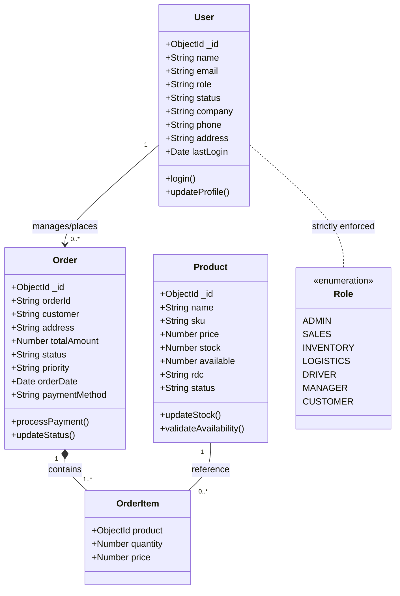
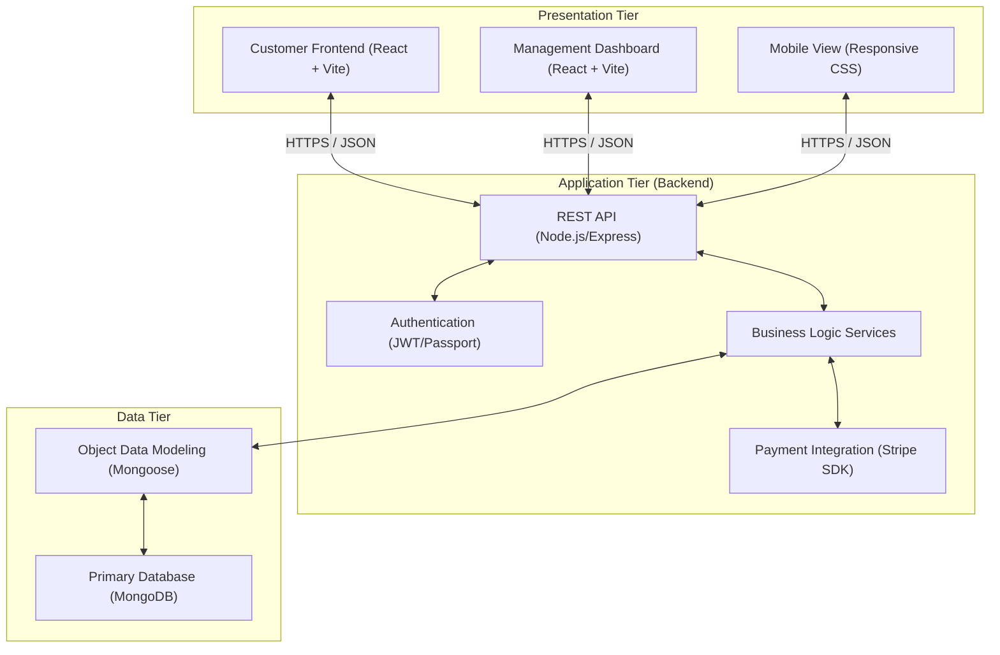

# ISDN Sales Distribution System - Overall System Design

This document details the software architecture, design patterns, and development environment for the ISDN Sales Distribution System.

## 1. Use Case Diagram
Describes the functional requirements from the perspective of different actors.

```mermaid
usecaseDiagram
    actor "System Administrator" as Admin
    actor "Sales Representative" as SalesRep
    actor "RDC Inventory Clerk" as Inventory
    actor "Logistics Officer" as Logistics
    actor "Delivery Driver" as Driver
    actor "Head Office Manager" as Manager
    actor "Online Customer" as Customer

    package "Management System" {
        usecase "Manage Users & Permissions" as UC1
        usecase "Database Configuration" as UC2
        usecase "Manage Product Catalog" as UC3
        usecase "Order Fulfillment Workflow" as UC4
        usecase "Real-time Inventory Tracking" as UC5
        usecase "Route & Delivery Assignment" as UC6
        usecase "Business Intelligence & Analytics" as UC7
        usecase "Invoice Generation" as UC8
    }

    package "Customer Portal" {
        usecase "Browse/Search Products" as UC9
        usecase "Manage Shopping Cart" as UC10
        usecase "Secure Checkout (Stripe)" as UC11
        usecase "Track Order Status" as UC12
    }

    Admin --> UC1
    Admin --> UC2
    
    SalesRep --> UC3
    SalesRep --> UC4
    SalesRep --> UC8
    
    Inventory --> UC5
    Inventory --> UC3
    
    Logistics --> UC6
    Logistics --> UC7
    
    Driver --> UC6
    Driver --> UC12
    
    Manager --> UC7
    Manager --> UC8
    
    Customer --> UC9
    Customer --> UC10
    Customer --> UC11
    Customer --> UC12
```

## 2. Class Diagram
Represents the data structures and relationships within the MongoDB database.



## 3. 3-Tier Architecture Diagram
Illustrates the separation of concerns across the technology stack.



## 4. Development Tools & Environment

The following tools and technologies were utilized in the development of this system:

| Category | Tools / Technologies |
| :--- | :--- |
| **Frontend** | React 18, Vite, Tailwind CSS, Lucide React, Framer Motion |
| **Backend** | Node.js, Express.js, TypeScript, Nodemon |
| **Database** | MongoDB, Mongoose ODM |
| **Payment Gateway** | Stripe API, React-Stripe-JS |
| **Diagramming** | Mermaid.js (UML Generation) |
| **Version Control** | Git |
| **API Testing** | Postman / Insomnia |
| **Package Management** | NPM (Node Package Manager) |
| **IDE** | VS Code |

## 5. Security Measures
- **Password Hashing**: (Planned) Bcrypt storage.
- **Data sanitization**: MongoDB query protection.
- **Authentication**: Role Based Access Control (RBAC).

---
*Generated by ISDN Sales Distribution System (Community) Architecture Team.*
